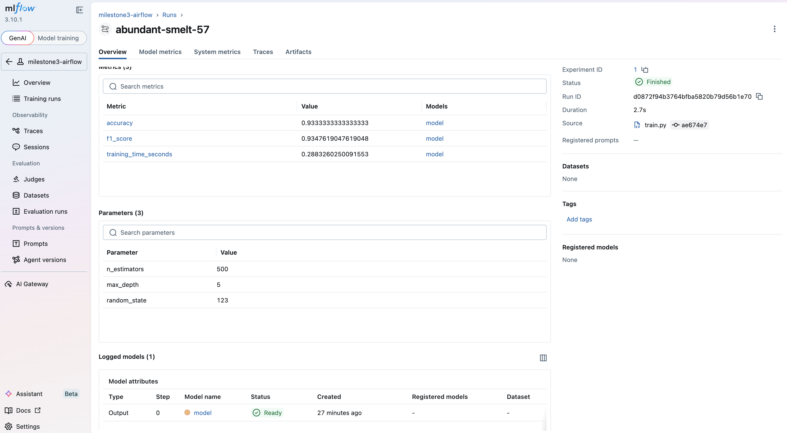
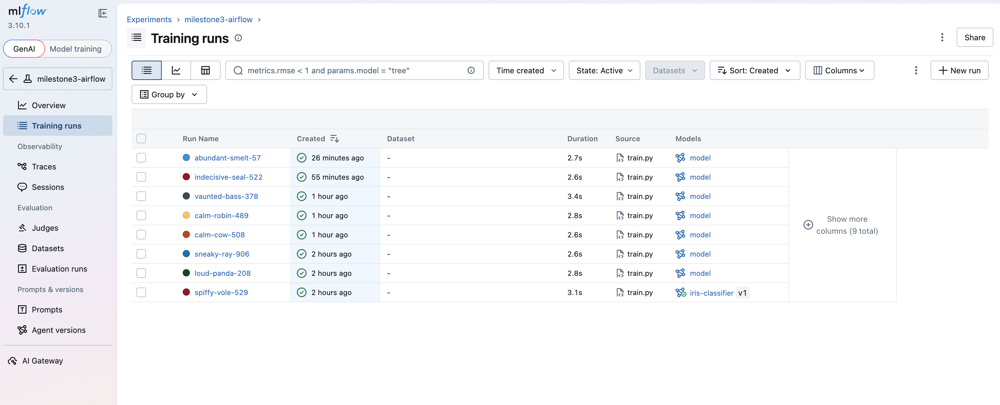

# Milestone 3: Unified MLOps Pipeline

This repository combines Airflow orchestration, CI quality gates, and MLflow tracking for an Iris + RandomForest workflow.

## Repository Structure

```text
milestone3/
├── .github/workflows/train_and_validate.yml
├── dags/train_pipeline.py
├── train.py
├── model_validation.py
├── register_model.py
├── requirements.txt
└── README.md
```

- `train.py`: trains model, logs params/metrics/model to MLflow, and writes `metrics.json`.
- `model_validation.py`: validates metrics against thresholds and writes `validation_report.json`.
- `register_model.py`: registers `runs:/<run_id>/model` into MLflow Model Registry.
- `dags/train_pipeline.py`: orchestrates `train -> validate -> register`.
- `.github/workflows/train_and_validate.yml`: CI pipeline with governance gates and artifact publishing.

## DAG Idempotency and Lineage Guarantees

- DAG ID: `milestone3_train_pipeline`
- Execution order is deterministic: `train_model >> validate_model >> register_model`.
- Registration is hard-gated by validation; if validation exits non-zero, registration does not execute.
- `max_active_runs=1` prevents overlapping runs of this DAG and reduces race conditions on shared outputs.
- Run configuration (`dag_run.conf`) is explicitly parsed and cast with defaults, so missing/invalid values fall back safely.

Retry and failure-handling configuration:

- `retry_delay`: `1 minute` between retry attempts.
- `max_retries`: `1` (Airflow field name: `retries`).
- `on_failure_callback`: `on_task_failure` writes failure context to `failure_events.log`; if `train_model` fails, stale `metrics.json` and `validation_report.json` are removed.

Lineage chain:

1. `train.py` creates MLflow run and writes `run_id` to `metrics.json`.
2. `model_validation.py` reads the same `metrics.json` and produces `validation_report.json`.
3. `register_model.py` reads `run_id` from `metrics.json` and registers `runs:/<run_id>/model`.

This guarantees that the registered model version is tied to the exact training run that passed validation.

## CI-Based Model Governance Approach

Governance is enforced in `.github/workflows/train_and_validate.yml`:

1. Install dependencies.
2. Train model (`train.py`).
3. Run threshold validation (`model_validation.py --min-accuracy 0.90 --min-f1 0.85`).
4. Register model only if prior steps succeed.
5. Upload governance evidence artifacts (`metrics.json`, `validation_report.json`, `mlflow.db`, `mlruns/`).

Key governance behavior:

- Quality gate is codified as CLI thresholds and non-zero exit on failure.
- Validation failure blocks downstream registration.
- Artifacts are always uploaded (`if: always()`) for auditability.

## Experiment Tracking Methodology

Tracking backend and artifacts:

- Tracking URI: `sqlite:///mlflow.db`
- Artifact store: local `mlruns/`
- Default registered model name: `iris-classifier`

Each training run logs:

- Parameters: `n_estimators`, `max_depth`, `random_state`
- Metrics: `accuracy`, `f1_score`, `training_time_seconds`
- Model artifact at `artifact_path=model`
- Metadata written to `metrics.json` including `run_id`, tracking URI, and experiment name

Recommended experiment naming:

- CI runs: `milestone3-ci`
- Airflow runs: `milestone3-airflow` or a custom `dag_run.conf.experiment_name`
- Local ad-hoc runs: purpose-specific names (for reproducibility and comparison)

## Setup and Execution Instructions

### 1) Local setup

```bash
cd milestone3
python -m venv venv
source venv/bin/activate
pip install -r requirements.txt
```

### 2) Run pipeline locally (script-by-script)

```bash
python train.py \
  --metrics-file metrics.json \
  --tracking-uri sqlite:///mlflow.db

python model_validation.py \
  --metrics-file metrics.json \
  --report-file validation_report.json \
  --min-accuracy 0.90 \
  --min-f1 0.85

python register_model.py \
  --metrics-file metrics.json \
  --tracking-uri sqlite:///mlflow.db \
  --model-name iris-classifier \
  --artifact-path model
```

### 3) Run with Airflow (Docker)

In `airflow-local/`:

```bash
docker compose up airflow-init
docker compose up -d
```

Make sure the Airflow container can access this project and set:

```bash
export MILESTONE3_DIR=/path/to/milestone3
```

Trigger DAG: `milestone3_train_pipeline`

Optional `dag_run.conf` example:

```json
{
  "n_estimators": 200,
  "max_depth": 8,
  "random_state": 123,
  "min_accuracy": 0.93,
  "min_f1": 0.90,
  "experiment_name": "milestone3-airflow-ui"
}
```

Supported `dag_run.conf` keys:

- `n_estimators` (int, default `100`)
- `max_depth` (int, default `5`)
- `random_state` (int, default `42`)
- `min_accuracy` (float, default `0.90`)
- `min_f1` (float, default `0.85`)
- `experiment_name` (string, default `milestone3-airflow`)

### 4) View experiments in MLflow UI

```bash
mlflow ui --backend-store-uri sqlite:///mlflow.db --port 5001
```

### 5) Optional: initialize/push repository

```bash
git init
git branch -M main
git add .
git commit -m "Initial commit: milestone3 mlops pipeline"
git remote add origin https://github.com/ZifengC/Milestone3.git
git push -u origin main
```

## MLflow Tracking Evidence




## Notes

- If MLflow schema migration errors occur after upgrades, back up and recreate DB:

```bash
mv mlflow.db mlflow.db.bak
```

- MLflow state files are local to this repo (`mlflow.db`, `mlruns/`).
- GitHub auto-detects workflow files from repository-root `.github/workflows/`.
